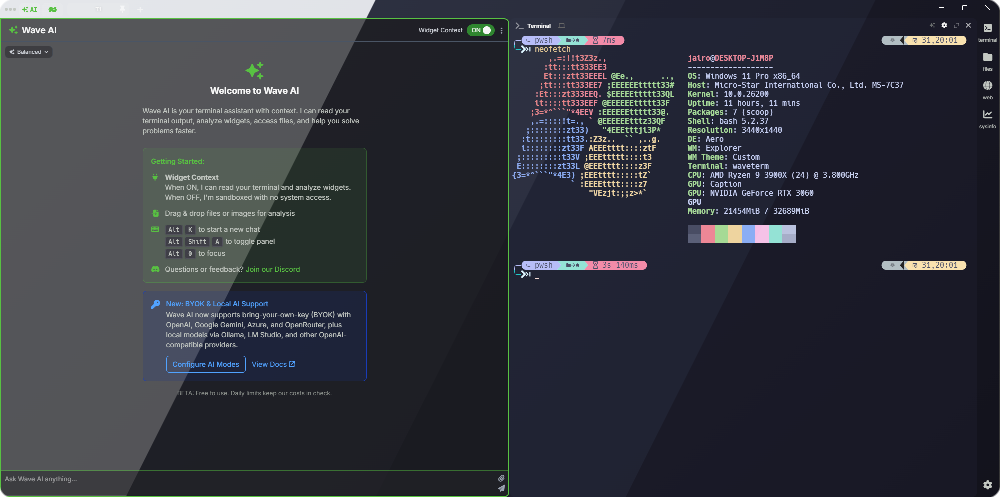
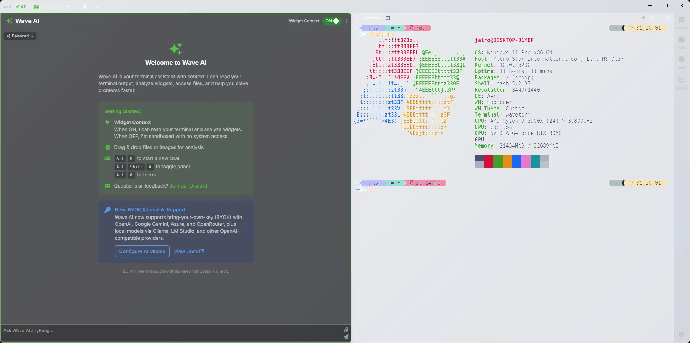
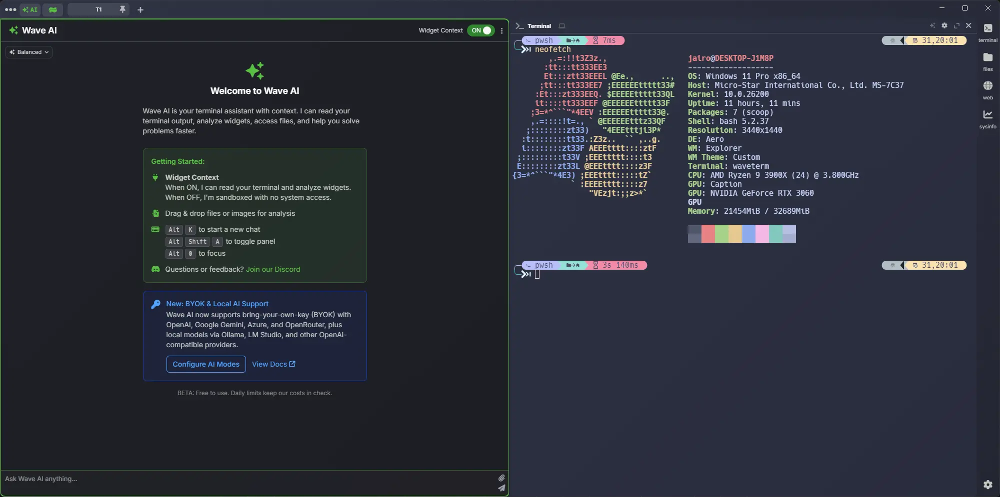
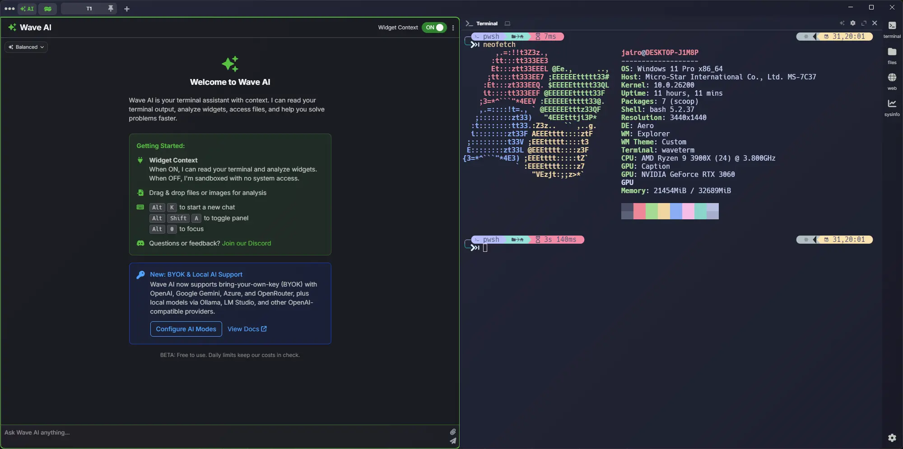
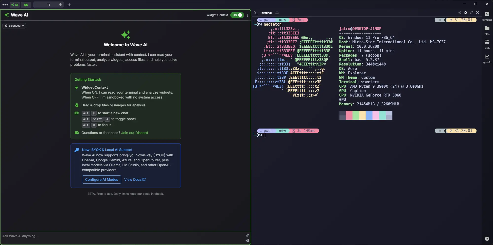

<h3 align="center">
	<br/>
	
	Catppuccin for <a href="https://www.waveterm.dev/">WaveTerm</a>
	
</h3>

<p align="center">
	<a href="https://github.com/catppuccin/waveterm/stargazers"></a>
	<a href="https://github.com/catppuccin/waveterm/issues"></a>
	<a href="https://github.com/catppuccin/waveterm/contributors"></a>
</p>

<p align="center">
	
</p>

## Previews

<details>
<summary>🌻 Latte</summary>

</details>
<details>
<summary>🪴 Frappé</summary>

</details>
<details>
<summary>🌺 Macchiato</summary>

</details>
<details>
<summary>🌿 Mocha</summary>

</details>

## Usage

> **⚠️ Important Note about Catppuccin Latte:** The Latte (light) theme is included in this repository but is **not recommended for use** at this time. Wave Terminal does not currently support a light mode UI—the application interface (icons, sidebars, buttons) is designed exclusively for dark themes. Using Latte will result in poor visibility with white/light-colored UI elements on a white background. See [#609](https://github.com/wavetermdev/waveterm/issues/609) and [#2686](https://github.com/wavetermdev/waveterm/issues/2686) for the ongoing light mode discussion. The Latte theme files are provided for future compatibility once Wave Terminal implements proper light mode support.

### Tab Backgrounds

1. Download the background presets from the [`themes/backgrounds/`](themes/backgrounds/) directory, or use one of the methods below:

   **All Flavors**
   ```bash
   curl -LO --output-dir ~/.config/waveterm/presets/ https://github.com/catppuccin/waveterm/raw/main/themes/backgrounds/catppuccin-backgrounds.json
   ```

2. Merge the contents of `catppuccin-backgrounds.json` into your `~/.config/waveterm/presets/presets.json` file (create it if it doesn't exist).

3. Apply a background:
   - **Via UI**: Right-click on any tab → Select **Backgrounds** → Choose your desired Catppuccin flavor
   - **Via Config**: Edit your `settings.json` file and add:
     ```json
     {
       "tab:preset": "bg@catppuccin-mocha"
     }
     ```

### Terminal Color Schemes

1. Download the theme files from the [`themes/terminal/`](themes/terminal/) directory, or use one of the methods below:

   **🌻 Latte** *(Not recommended - see note above)*
   ```bash
   curl -LO --output-dir ~/.config/waveterm/termthemes https://github.com/catppuccin/waveterm/raw/main/themes/terminal/catppuccin-latte.json
   ```

   **🪴 Frappé**
   ```bash
   curl -LO --output-dir ~/.config/waveterm/termthemes https://github.com/catppuccin/waveterm/raw/main/themes/terminal/catppuccin-frappe.json
   ```

   **🌺 Macchiato**
   ```bash
   curl -LO --output-dir ~/.config/waveterm/termthemes https://github.com/catppuccin/waveterm/raw/main/themes/terminal/catppuccin-macchiato.json
   ```

   **🌿 Mocha**
   ```bash
   curl -LO --output-dir ~/.config/waveterm/termthemes https://github.com/catppuccin/waveterm/raw/main/themes/terminal/catppuccin-mocha.json
   ```

2. The theme files should be placed in your WaveTerm config directory:
   - **Linux**: `~/.config/waveterm/termthemes/`
   - **macOS**: `~/.config/waveterm/termthemes/`
   - **Windows**: `%USERPROFILE%\.config\waveterm\termthemes\`

3. Apply the theme:
   - **Via UI**: Right-click in the header area of any terminal block → Select your desired Catppuccin flavor
   - **Via Config**: Edit your `settings.json` file and add:
     ```json
     {
       "term:theme": "catppuccin-mocha"
     }
     ```

### Setting a Default Theme

To set a Catppuccin theme as your default for all new tabs and terminals, add both settings to your `settings.json`:

```json
{
  "term:theme": "catppuccin-mocha",
  "tab:preset": "bg@catppuccin-mocha"
}
```

For more information on Wave Terminal customization, see the [official documentation](https://docs.waveterm.dev/customization).

## FAQ

**Q: "Where is Catppuccin Latte (light theme)? / Why doesn't Latte work properly?"**

**A:** Catppuccin Latte is included in the repository, but it is **not recommended for use** at this time. Wave Terminal does not currently support a light mode UI (see [#609](https://github.com/wavetermdev/waveterm/issues/609) and [#2686](https://github.com/wavetermdev/waveterm/issues/2686)). The entire application interface—including icons, sidebars, and navigation—is designed exclusively for dark themes. Using Latte will result in poor visibility with light-colored UI elements (white icons, light text) on a white/light background, making the interface difficult or impossible to use. The Latte theme files are provided for future compatibility once Wave Terminal implements proper light mode support. Until then, we recommend using one of the three dark flavors: Frappé, Macchiato, or Mocha.

**Q: "Where can I find my Wave Terminal config files?"**

**A:** Wave Terminal stores its configuration files in:
- **Linux/macOS**: `~/.config/waveterm/`
- **Windows**: `%USERPROFILE%\.config\waveterm\`

**Q: "The terminal colors don't look right."**

**A:** Make sure you've placed the theme files in the correct `termthemes` directory and that the theme is properly applied via the UI or config file.

**Q: "Can I use different flavors for terminal and background?"**

**A:** Yes! You can mix and match. For example, you could use Mocha for the terminal theme and Frappé for the tab background.

## 💝 Thanks to

- [Jairo Morales - (icky17)](https://github.com/Icky17)

&nbsp;

<p align="center">
	
</p>

<p align="center">
	Copyright &copy; 2021-present <a href="https://github.com/catppuccin" target="_blank">Catppuccin Org</a>
</p>

<p align="center">
	<a href="https://github.com/catppuccin/catppuccin/blob/main/LICENSE"></a>
</p>
